# SPL Token Dropper

A high-performance, production-ready SPL token distribution tool for Solana. Handles massive airdrops with automatic retry, state persistence, and crash recovery.

## Architecture Overview


## Distribution Flow


## State Management


## Features

- 🚀 **High Performance**: Batch processing with configurable rate limiting
- 💾 **State Persistence**: Automatic resume from interruptions
- 🔄 **Smart Retries**: Handles expired transactions automatically
- 📊 **Progress Tracking**: Real-time distribution progress with clear recipient ranges
- 💰 **Cost Estimation**: Dynamic SOL cost predictions based on priority fees
- 🔒 **Safe**: Prevents double-spending and tracks all operations
- 📁 **CSV-based**: Simple recipient list management
- 🧪 **Test Mode**: Use `--limit` to test with small batches before full runs
- 💸 **Fee Optimization**: Calculates actual costs based on your priority fee settings

## Transaction Batching Process


## Cost Calculation

```mermaid
graph TD
    subgraph "Cost Components"
        BASE[Base Fee<br/>0.000005 SOL]
        PRIORITY[Priority Fee<br/>priority × 200k CU ÷ 1e15]
        RENT[ATA Rent<br/>0.00203928 SOL/account]
    end
    
    subgraph "Transaction Costs"
        ATA_TX[ATA Creation Txs<br/>count ÷ 10 × tx_fee]
        TRANSFER_TX[Transfer Txs<br/>recipients ÷ 10 × tx_fee]
    end
    
    subgraph "Total Cost"
        TOTAL[Total Estimated Cost]
    end
    
    BASE --> ATA_TX
    PRIORITY --> ATA_TX
    BASE --> TRANSFER_TX
    PRIORITY --> TRANSFER_TX
    RENT --> TOTAL
    ATA_TX --> TOTAL
    TRANSFER_TX --> TOTAL
    
    style BASE fill:#e8f5e9
    style PRIORITY fill:#fff9c4
    style RENT fill:#fce4ec
    style TOTAL fill:#e1f5fe
```



## Installation

```bash
cargo build --release
```

## Quick Start

1. **Prepare your recipient list** (CSV format):
```csv
recipient,amount
EPjFWdd5AufqSSqeM2qN1xzybapC8G4wEGGkZwyTDt1v,1000000000
So11111111111111111111111111111111111111112,2000000000
```

2. **Run distribution**:
```bash
./target/release/spl-dropper distribute \
  --input-csv recipients.csv \
  --mint <TOKEN_MINT> \
  --from <SOURCE_TOKEN_ACCOUNT> \
  --owner owner.json \
  --fee-payer payer.json \
  --url https://api.mainnet-beta.solana.com \
  --priority-fee 20000
```

For testing with a small batch first:
```bash
./target/release/spl-dropper distribute \
  --input-csv recipients.csv \
  --mint <TOKEN_MINT> \
  --from <SOURCE_TOKEN_ACCOUNT> \
  --owner owner.json \
  --fee-payer payer.json \
  --url https://api.mainnet-beta.solana.com \
  --priority-fee 20000 \
  --limit 5 \
  --dry-run
```

3. **Monitor progress**: The tool shows real-time progress and saves state automatically.

## Key Commands

### Distribute Tokens
```bash
spl-dropper distribute [OPTIONS]
```

Options:
- `--input-csv`: Path to CSV with recipients
- `--mint`: SPL token mint address
- `--from`: Source token account
- `--owner`: Owner keypair (controls source account)
- `--fee-payer`: Fee payer keypair
- `--url`: RPC URL
- `--rate-limit`: Requests per second (default: 10)
- `--priority-fee`: Priority fee in microlamports per CU (default: 1000)
- `--limit`: Limit number of recipients to process (useful for testing)
- `--dry-run`: Preview distribution without executing
- `--skip-ata`: Skip ATA creation checks
- `--yes`: Skip confirmation prompt
- `--force-clear-pending`: Force clear pending transactions (use if manually verified)

### Generate Test Recipients
```bash
spl-dropper generate-recipients \
  --count 1000 \
  --amount 1000000000 \
  --output test_recipients.csv
```


## State Management

The tool automatically tracks distribution state in `.spl-dropper-state/<hash>/` directories:
- Each unique CSV+mint combination gets its own state
- Automatic resume on interruption
- Prevents accidental re-processing

### Progress Tracking

The tool provides clear progress information:
```
📊 Progress: 5/973 recipients already completed
📊 Processing recipients 6 to 10 (limiting to 5 out of 968 remaining)
```

When distribution completes:
```
✅ Distribution complete!
Total progress: 10/973 recipients completed
This run: 5 recipients processed
```

## Safety Features

- **Balance Checks**: Prevents starting distributions without sufficient tokens
- **Duplicate Prevention**: Tracks completed recipients
- **Transaction Monitoring**: Handles confirmations and expirations
- **Atomic State Updates**: Single-writer pattern prevents corruption

## Cost Estimation

Run with `--dry-run` to see detailed cost breakdown:
- ATA creation costs (one-time): 0.00203928 SOL per account
- Transaction fees: Base fee (0.000005 SOL) + Priority fee
- Priority fees: Calculated as `priority_fee × 200,000 CU / 1e15`

Example with different priority fees:
- `--priority-fee 10000`: ~0.000007 SOL per transaction
- `--priority-fee 20000`: ~0.000009 SOL per transaction
- `--priority-fee 50000`: ~0.000015 SOL per transaction

## Using the --limit Parameter

The `--limit` parameter is perfect for:
- Testing your setup before a full mainnet run
- Processing large airdrops in smaller, manageable batches
- Verifying transaction costs with real transactions

Example workflow:
```bash
# Test with 5 recipients
./target/release/spl-dropper distribute ... --limit 5 --dry-run

# Process first 10
./target/release/spl-dropper distribute ... --limit 10 --yes

# Process next 50 (automatically skips completed)
./target/release/spl-dropper distribute ... --limit 50 --yes

# Process all remaining
./target/release/spl-dropper distribute ... --yes
```

## Performance

- Processes in batches of 10 transfers per transaction
- Configurable rate limiting
- Automatic retry for failed/expired transactions
- Typical throughput: 100-500 recipients/minute

## Development

Run tests:
```bash
cargo test
```

## License

MIT
